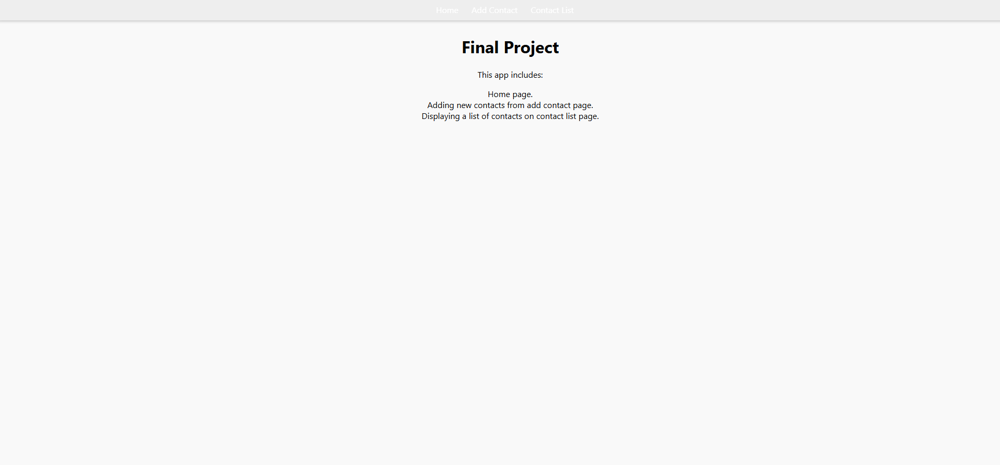
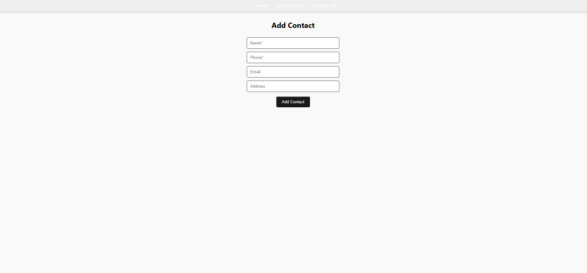
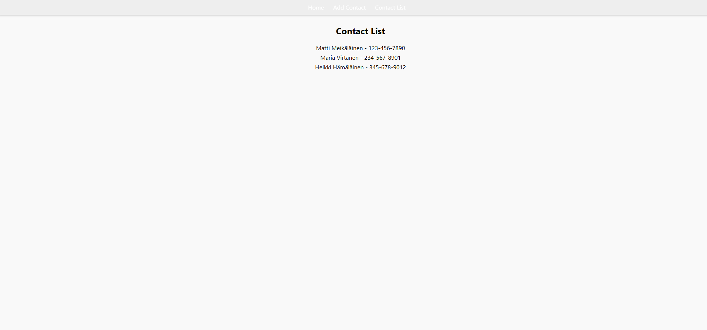
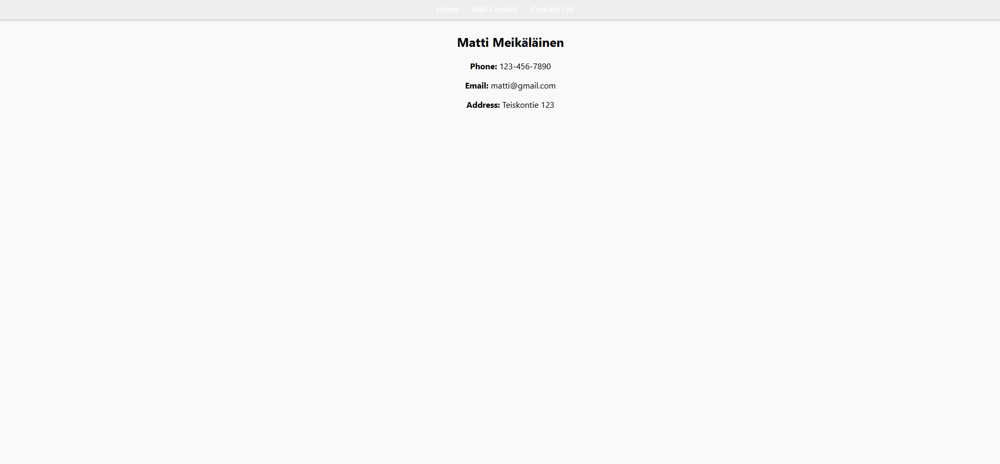

# Fundamentals of react.js project

A **Multi-View Single-Page Application**

## Features
- Home page with app description  
- Add new contacts (Name, Phone, Email, Address)  
- View contact list with clickable names  
- Contact details page via dynamic route  
- Navbar for navigation

## Screenshots

### Home


### Add Contact


### Contact List


### Contact Details


## Setup
```bash
git clone https://github.com/jaspersvensberg/Fundamentals-of-React.js-project.git
cd Fundamentals-of-React.js-project
npm install
npm start
